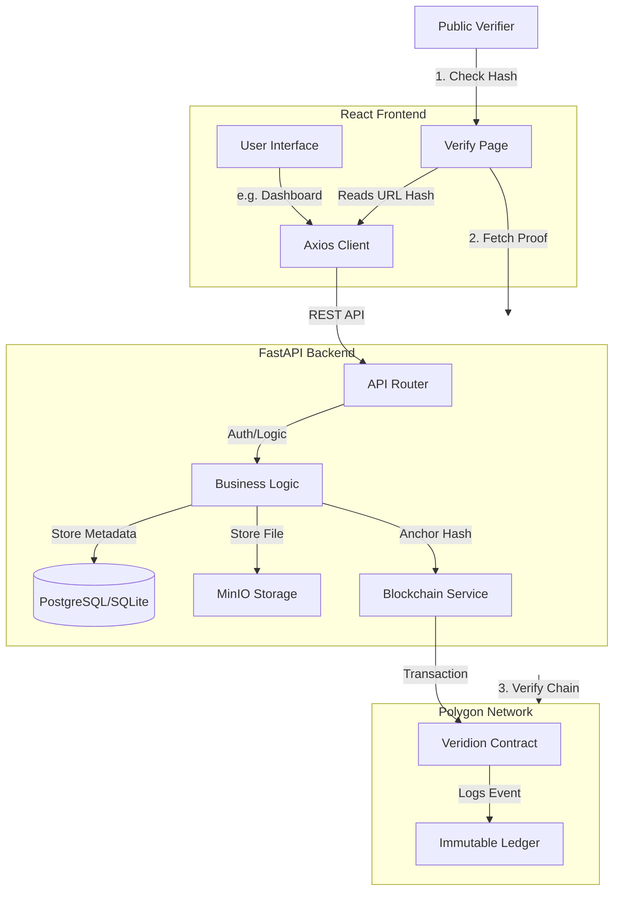
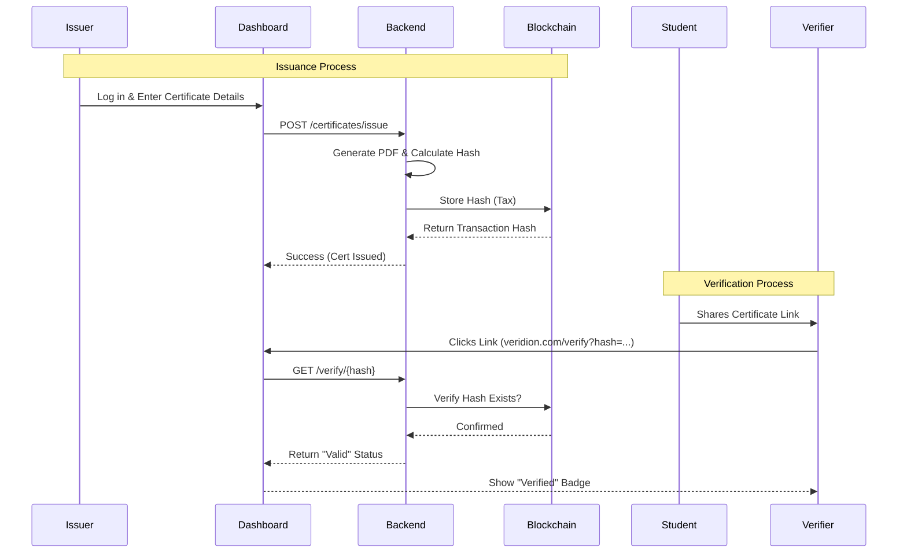

```
██╗   ██╗███████╗██████╗ ██╗██████╗ ██╗ ██████╗ ███╗   ██╗
██║   ██║██╔════╝██╔══██╗██║██╔══██╗██║██╔═══██╗████╗  ██║
██║   ██║█████╗  ██████╔╝██║██║  ██║██║██║   ██║██╔██╗ ██║
╚██╗ ██╔╝██╔══╝  ██╔══██╗██║██║  ██║██║██║   ██║██║╚██╗██║
 ╚████╔╝ ███████╗██║  ██║██║██████╔╝██║╚██████╔╝██║ ╚████║
  ╚═══╝  ╚══════╝╚═╝  ╚═╝╚═╝╚═════╝ ╚═╝ ╚═════╝ ╚═╝  ╚═══╝
            Blockchain Certificate Verification
```

Veridion is a next-generation, blockchain-powered certificate verification platform. It enables institutions to issue tamper-proof digital credentials that can be instantly verified by anyone, anywhere, without relying on a central authority.

Built with React, FastAPI, and Polygon Blockchain Integration.

---

## Key Features

*   **Immutable Trust**: Certificates are hashed and anchored on the blockchain (Polygon/Ethereum).
*   **Instant Verification**: Verify credentials in milliseconds via unique hash or QR code.
*   **Issuer Dashboard**: A powerful command center for organizations to issue, track, and manage certificates.
*   **Custom Domain Support**: Institutions can verify credentials on their own domain (e.g., verify.university.edu).
*   **Dynamic Analytics**: Real-time insights into issuance trends and network activity.
*   **Matrix-Style UI**: A premium, dark-mode aesthetic with animated backgrounds and sleek interactions.

---

## Architecture

Veridion uses a layered architecture to ensure security and scalability.



## User Flow: Issuance & Verification



---

## Tech Stack

*   **Frontend**: React 18, Vite, Tailwind CSS, Framer Motion, Recharts.
*   **Backend**: Python, FastAPI, SQLAlchemy, Pydantic.
*   **Database**: SQLite (Dev) / PostgreSQL (Prod).
*   **Blockchain**: Polygon / Ethereum (Web3.py).
*   **Storage**: Local / MinIO / IPFS.

---

## Getting Started

### Prerequisites
*   Node.js & npm
*   Python 3.9+
*   Git

### Installation

1.  **Clone the Repository**
    ```bash
    git clone https://github.com/yourusername/veridion.git
    cd veridion
    ```

2.  **Frontend Setup**
    ```bash
    cd frontend
    npm install
    npm run dev
    ```

3.  **Backend Setup**
    ```bash
    cd backend
    python -m venv venv
    source venv/bin/activate  # On Windows: venv\Scripts\activate
    pip install -r requirements.txt
    uvicorn app.main:app --reload
    ```

4.  **Access the App**
    *   Frontend: http://localhost:5173
    *   Backend Docs: http://localhost:8000/docs

---

## License

MIT License. Built for a more trusted world.
