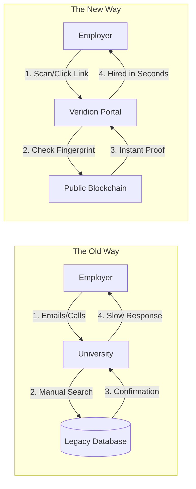
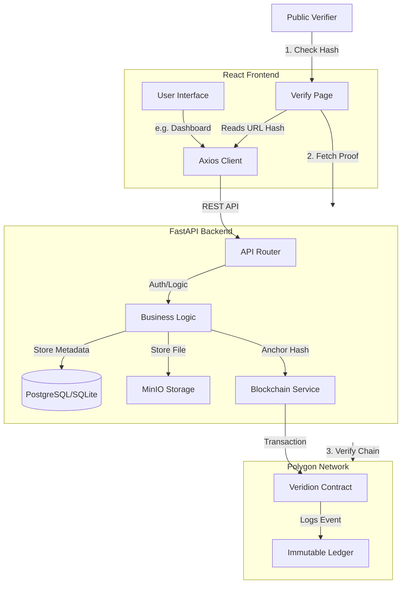

<div align="center">

```
██╗   ██╗███████╗██████╗ ██╗██████╗ ██╗ ██████╗ ███╗   ██╗
██║   ██║██╔════╝██╔══██╗██║██╔══██╗██║██╔═══██╗████╗  ██║
██║   ██║█████╗  ██████╔╝██║██║  ██║██║██║   ██║██╔██╗ ██║
╚██╗ ██╔╝██╔══╝  ██╔══██╗██║██║  ██║██║██║   ██║██║╚██╗██║
 ╚████╔╝ ███████╗██║  ██║██║██████╔╝██║╚██████╔╝██║ ╚████║
  ╚═══╝  ╚══════╝╚═╝  ╚═╝╚═╝╚═════╝ ╚═╝ ╚═════╝ ╚═╝  ╚═══╝
            Blockchain Certificate Verification
```

</div>

Veridion is a next-generation, blockchain-powered certificate verification platform. It enables institutions to issue tamper-proof digital credentials that can be instantly verified by anyone, anywhere, without relying on a central authority.

Built with React, FastAPI, and Polygon Blockchain Integration.

---

## Why Veridion? Understanding the Significance

In a world where digital data is easily manipulated, Veridion solves the core problem of trust.

### The Problem: The Verification Gap
Traditional certificate verification is slow and insecure:
*   **Forgeries**: Paper and digital PDFs are easily Altered.
*   **Manual Overhead**: Employers must contact institutions directly to verify credentials.
*   **Central Hazards**: If an institution's database is lost or corrupted, so are your achievements.

### The Solution: The Veridion Way
Veridion bridges this gap using "Digital Fingerprints" and "Distributed Ledgers."



### Core Concepts for Beginners

#### 1. Digital Fingerprints (Hashing)
Every certificate issued through Veridion is passed through a mathematical function that creates a unique "Fingerprint" (a long string of characters). If even a single pixel in the certificate is changed, the fingerprint changes entirely. Veridion stores this fingerprint, not your personal data, ensuring privacy and security.

#### 2. The Permanent Ledger (Blockchain)
Veridion stores these fingerprints on the Polygon Network—a decentralized ledger shared across thousands of computers globally. Once a record is "anchored" here, it cannot be deleted, edited, or suppressed. It becomes a permanent part of history.

#### 3. Trustless Verification
You no longer need to "trust" the person showing you a diploma. You simply verify the fingerprint against the blockchain. The math provides the truth, making the process faster, cheaper, and more reliable than any human-gatekeeper system.

---

## Key Features

*   **Immutable Trust**: Fingerprints are anchored on the blockchain (Polygon/Ethereum).
*   **Instant Verification**: Verify credentials in milliseconds via unique hash or URL.
*   **Issuer Dashboard**: A professional command center for institutions to manage records.
*   **Custom Domain Support**: Institutions can host the verification portal on their own domain.
*   **Dynamic Analytics**: Track issuance trends and network stats in real-time.
*   **Matrix-Theme Interface**: A premium, high-tech aesthetic designed for the modern web.

---

## Architecture

Veridion uses a layered architecture to ensure security and scalability.



---

## Tech Stack

*   **Frontend**: React 18, Vite, Tailwind CSS, Framer Motion, Recharts.
*   **Backend**: Python, FastAPI, SQLAlchemy, Pydantic.
*   **Database**: SQLite (Dev) / PostgreSQL (Prod).
*   **Blockchain**: Polygon / Ethereum (Web3.py).
*   **Storage**: MinIO / Local FS / IPFS.

---

## Getting Started

### Prerequisites
*   Node.js & npm
*   Python 3.9+
*   Git

### Installation

1.  **Clone the Repository**
    ```bash
    git clone https://github.com/yourusername/veridion.git
    cd veridion
    ```

2.  **Frontend Setup**
    ```bash
    cd frontend
    npm install
    npm run dev
    ```

3.  **Backend Setup**
    ```bash
    cd backend
    python -m venv venv
    source venv/bin/activate  # On Windows: venv\Scripts\activate
    pip install -r requirements.txt
    uvicorn app.main:app --reload
    ```

4.  **Access the App**
    *   Frontend: http://localhost:5173
    *   Backend Docs: http://localhost:8000/docs

---

## License

MIT License. Built for a more trusted world.
